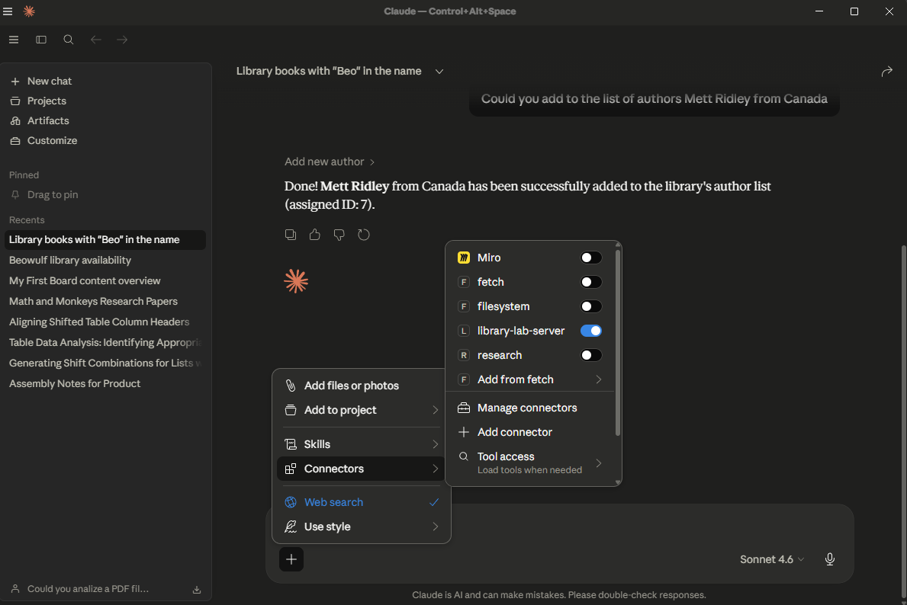
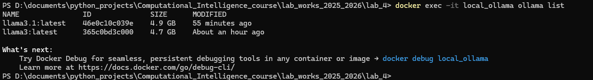
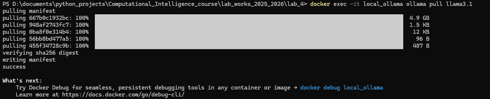
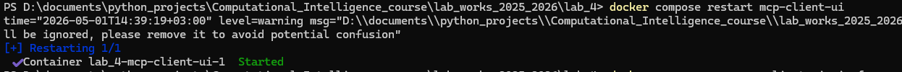
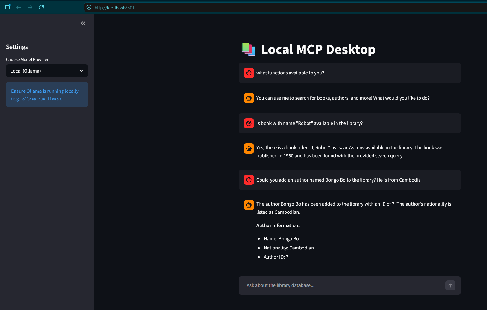

# Lab 4: Description

## Part I: Develop own MCP server

1. Create Docker container with Postgres database, which contains 1-3 tables.
2. Make connection to that DB via Python (Pydantic / SQLAlchemy / SQLModel).
3. Create via Python scheme to those tables and fill them with some example data.
4. Write an MCP Server with functions (3-10 functions) to interact with that DB.
5. Connect from Anthropic (Claude) model (look if it possible with other providers like Google / OpenAI / Mistral)

## Part II: Develop own MCP client

1. Develop code for MCP client with using LLM by API and (or) LLM hosted locally. 
   (While you can write this from scratch, libraries like LangChain and LlamaIndex already have built-in MCP tool wrappers. 
   This makes it trivial to swap between Anthropic, Google (Gemini), OpenAI, or local models (via Ollama).)
2. Implement it as server hosted on own Docker container.

---

---

# How to run the code / do the lab work

## I. Create & validate creation of Postgres database

1. Go to the project root directory (`lab_4`) in your console.
2. Run command: `docker compose up -d`
3. Validate with command: 
   `docker exec -e PGPASSWORD='M&1_V3r^_C9#pLeX_P@$s' -it mcp_postgres_db psql -U mcp_user -d mcp_database -c "SELECT * FROM books;"`
4. *Note: without the password flag it also works (`docker exec -it mcp_postgres_db psql -U mcp_user -d mcp_database -c "SELECT * FROM books;"`), but the password flag is kept for automated testing setups.*

---

## II. Create own MCP server

1. After executing the commands above and confirming that your DB is filled with data, ensure your terminal is in the `lab_4` root directory.
2. Analyze the code in `src/database.py` — here is the connection to your DB via Python.
3. Uncomment 40-47, and comment 50-57 in `src/database.py`.
4. Test if the connection via Python to the DB works by executing: `python -m tests.test_db_conn`
5. Analyze the code in `src/server.py` — there is your actual MCP server.
6. Check if all works on your `Claude Desktop`:
   1. Press `Win + R` to open the Run dialog. 
   2. Type `%APPDATA%\Claude` and press `Enter`. 
   3. Look for a file named `claude_desktop_config.json`.
   4. Add your server configuration to that file (`TODO`: adjust the paths below to match your actual system paths):
    ```json
    {
      "mcpServers": {
        "library-lab-server": {
          "command": "D:\\documents\\python_projects\\Computational_Intelligence_course\\.venv\\Scripts\\python.exe",
          "args": [
            "D:\\documents\\python_projects\\Computational_Intelligence_course\\lab_works_2025_2026\\lab_4\\src\\server.py"
          ]
        }
      }
    }
    ```
   5. Fully restart your `Claude Desktop`.
   6. Open `Claude Desktop` the `library-lab-server` should appear in the list of your `Connectors`. Like it shown on image below
   
7. `TODO 1`: Your task here is to add a few tool-functions to `src/server.py` like it was in the example.
8. `TODO 2`: Check if your code works using "Claude Desktop" and connect it with your MCP server.

---

## Run local LLM model to perform agentic stuff

`WARNING` this step require at least 5-6Gb of RAM, make sure your computer has such amount available.

1. Comment 40-47, and Uncomment 50-57 in `src/database.py`, to make sure you connection to DB works internally in Docker.
2. Because you already run command `docker compose up -d` you installed a Llama container. So now you need to check if the 
   models available with command `docker exec -it local_ollama ollama list`.
   
3. I recommend you to use `Llama3.1` model, although you can run any local models like `Gemma` from Google (or any other providers)
4. To install the model simply run: `docker exec -it local_ollama ollama pull llama3.1`.
   
5. Also, you probably will need to restart your server. Do it with command: `docker compose restart mcp-client-ui`
   
6. Now you can open the [Your Chatbot](http://localhost:8501/) page and communicate with your agentic chatbot.
   
7. `TODO 3`: Try to use other providers (but you probably will need API key). I recommend try with TogetherAI, 
   they give 1$ credits (which is a lot for this lab). 
   Or you can configure your Anthropic API or Google Vertex AI API, Open AI also valid.
8. `TODO 4`: Check if your tools works correctly, and the LLM do what it suppose to do.

